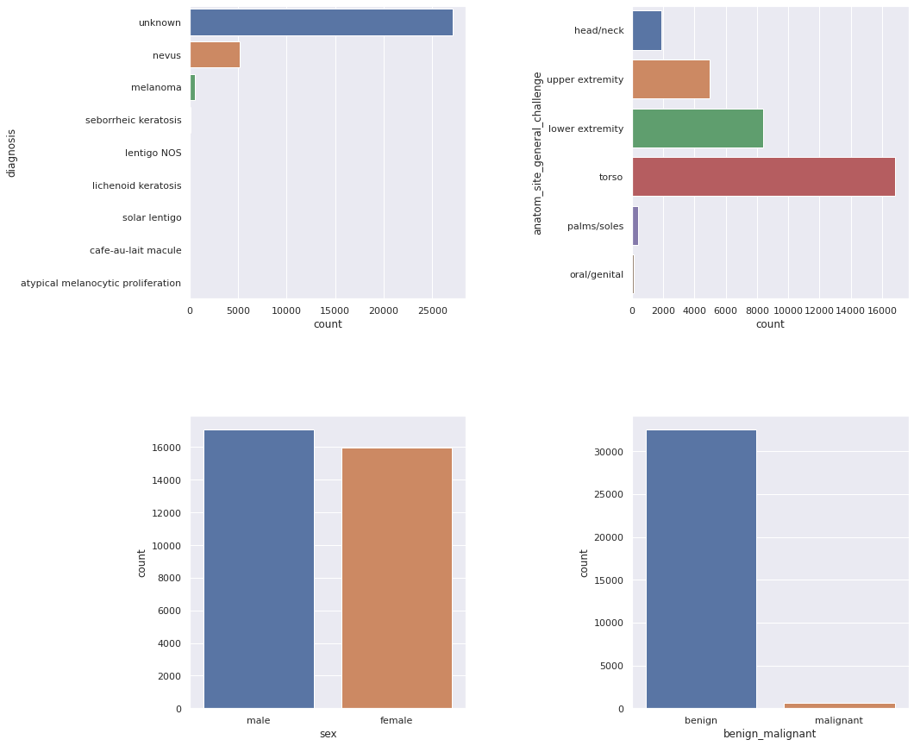
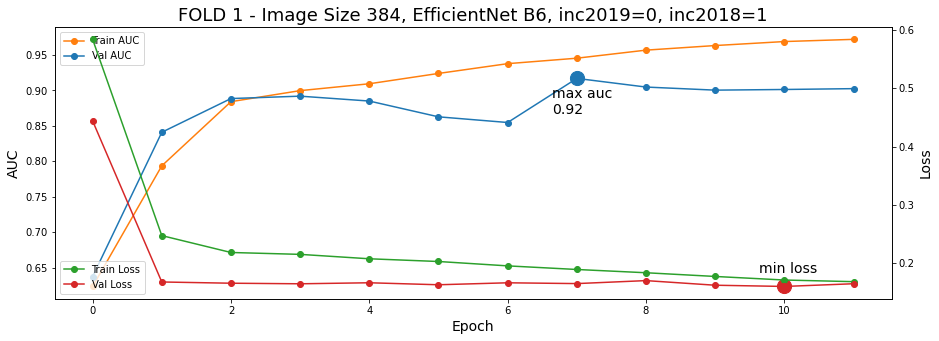
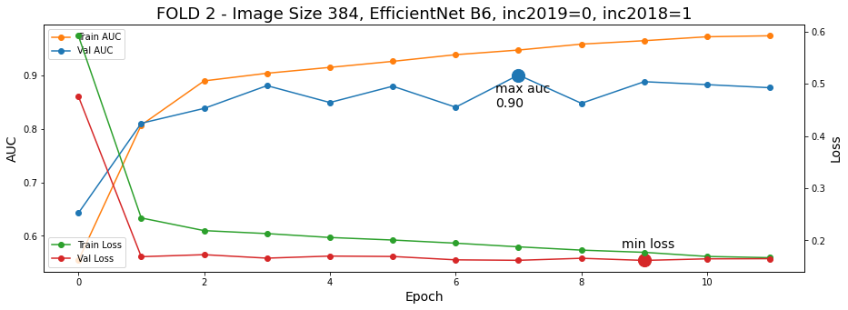
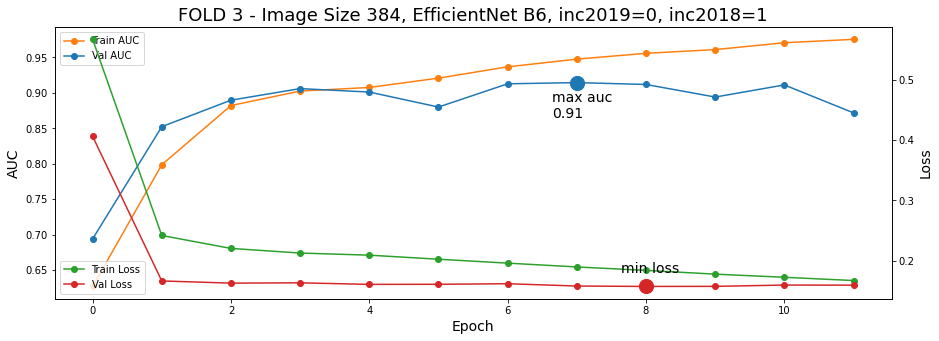
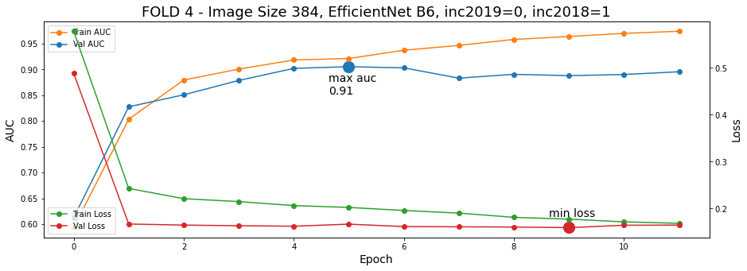
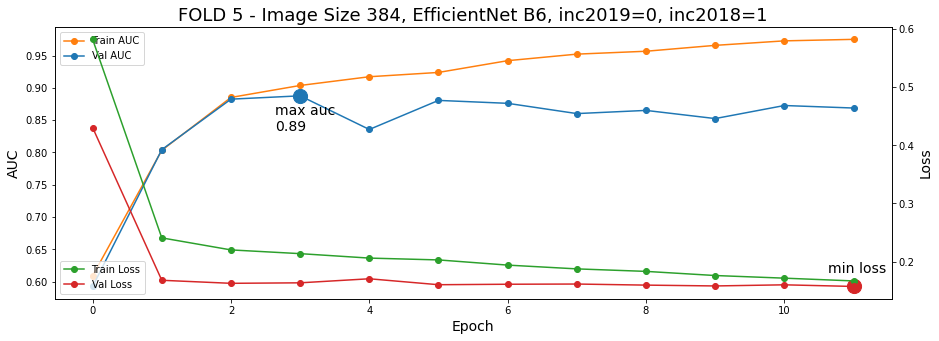
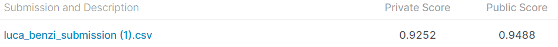

# siimIsicMelanomaWithKFold
Project for kaggle competition Siim isic melanoma classification

# SIIM-ISIC-MELANOMA-CLASSIFICATION-2020

This repository consists of the code I used to create my submission file for [ISIC-2020 Challenge](https://www.kaggle.com/c/siim-isic-melanoma-classification).

## Data

In order to run the code first you need to download the [data](https://www.kaggle.com/c/siim-isic-melanoma-classification/data).
The data folder should include 'train.csv', 'submission.csv' and 'test.csv' and folder with an images.

### Data Distribution

##  Observations

### Accuracy and Loss

### Classification Report

This is my result on the competetion.

## Contributors
<table>
  <tr>
    <td align="center"><a href="https://github.com/onboarding92"> <b>Luca Benzi</b></a> <a href="https://github.com/deepHealthProjectISIC2019/commits?author=BenziLuca" title="Code">💻</a> <a href="#ideas-BenziLuca" title="Ideas, Planning, & Feedback">🤔</a> <a href="#tool-BenziLuca" title="Tools">🔧</a></td>
  </tr>
</table>
